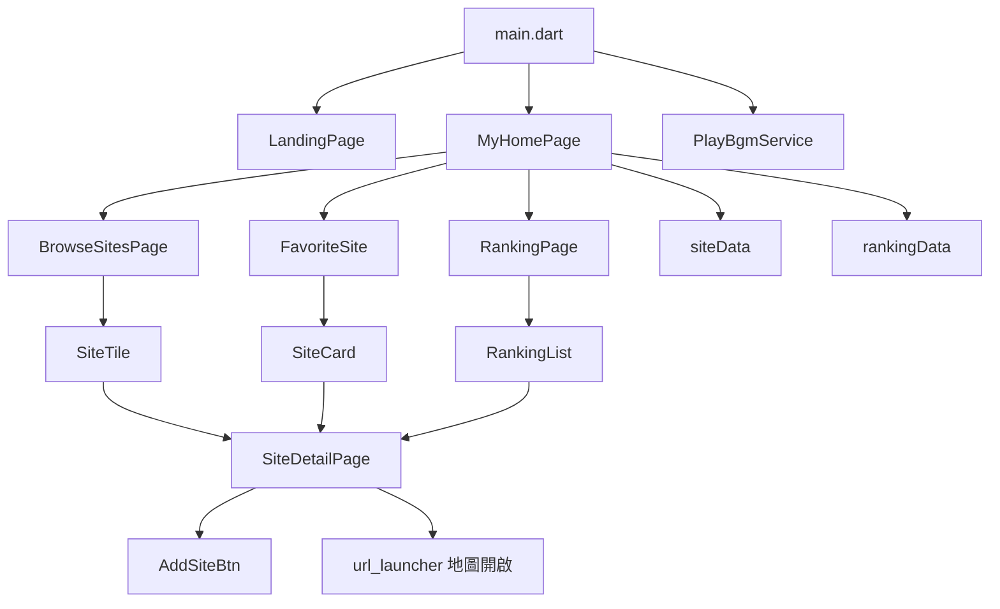

# Site Explorer（flutter_hw3）

## 專案介紹
Site Explorer 是一個以 Flutter 開發的旅遊景點探索 App，提供景點瀏覽、標籤篩選、收藏管理、排行榜與詳細資訊頁。  
資料來源為專案內建的景點清單，內容涵蓋多個洲別與不同主題，適合用來練習 Flutter 畫面組裝、狀態管理與頁面導覽。

## 主要功能
- 首頁引導與使用說明對話框
- 景點列表瀏覽與標籤篩選
- 收藏清單管理（加入、取消、空狀態提示）
- 熱門排行、秘境排行雙榜單
- 景點詳細頁（圖片、簡介、地圖連結、隨機推薦）
- 背景音樂播放與前景/背景切換處理

## 技術與套件
- Flutter / Dart
- `flutter_svg`：載入 SVG 圖示
- `google_fonts`：字體樣式
- `url_launcher`：開啟地圖連結
- `audioplayers`：背景音樂播放

## 使用說明
### 1. 環境需求
- Flutter SDK（對應 Dart `^3.11.0`）

### 2. 安裝相依套件
```bash
flutter pub get
```

### 3. 啟動專案
```bash
flutter run
```

### 4. 基本檢查
```bash
flutter analyze
flutter test
```

## 專案架構圖


## 目錄結構
```text
lib/
├─ main.dart                    # App 入口、Tab 結構、收藏與篩選狀態
├─ data/
│  ├─ siteData.dart             # 景點資料
│  └─ rankingData.dart          # 排行邏輯（熱門/秘境）
├─ model/
│  └─ site.dart                 # Site 資料模型
├─ pages/
│  ├─ landingPage.dart          # 進入頁與使用說明
│  ├─ browseSitesPage.dart      # 景點瀏覽頁
│  ├─ rankingPage.dart          # 排行榜頁
│  └─ siteDetailPage.dart       # 景點詳細頁
├─ widgets/
│  ├─ siteTile.dart             # 列表卡片
│  ├─ siteCard.dart             # 收藏卡片
│  ├─ favoriteSite.dart         # 收藏頁內容
│  └─ addSiteBtn.dart           # 收藏按鈕元件
└─ service/
   └─ playBGM.dart              # 背景音樂服務
```

## 畫面流程
1. 進入 `LandingPage` 後點選開始探索
2. 進入 `MyHomePage`，可在三個主分頁切換：尋找更多、已收藏、排行榜
3. 由列表或排行榜進入 `SiteDetailPage` 查看完整資訊
4. 可在詳細頁直接加入或取消收藏，並開啟 Google Maps
